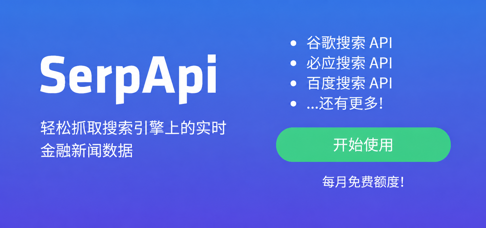

<div align="center">

# 📈 台股/美股自选股智能分析系统

[](https://github.com/ZhuLinsen/daily_stock_analysis/stargazers)
[](https://github.com/ZhuLinsen/daily_stock_analysis/actions/workflows/ci.yml)
[](https://opensource.org/licenses/MIT)
[](https://www.python.org/downloads/)
[](https://github.com/features/actions)
[](https://hub.docker.com/r/zhulinsen/daily_stock_analysis)

<p align="center">
  <a href="https://trendshift.io/repositories/18527" target="_blank"></a>&nbsp;<a href="https://hellogithub.com/repository/ZhuLinsen/daily_stock_analysis" target="_blank"></a>
</p>

> 🤖 基于 AI 大模型的台股/美股自选股智能分析系统，每日自动分析并推送「决策仪表盘」到企业微信/飞书/Telegram/Discord/Slack/邮箱

[**产品预览**](#-产品预览) · [**功能特性**](#-功能特性) · [**快速开始**](#-快速开始) · [**推送效果**](#-推送效果) · [**文档中心**](docs/INDEX.md) · [**完整指南**](docs/full-guide.md)

简体中文 | [English](docs/README_EN.md) | [繁體中文](docs/README_CHT.md)

</div>

## 💖 赞助商 (Sponsors)
<div align="center">
  <p align="center">
    <a href="https://open.anspire.cn/?share_code=QFBC0FYC" target="_blank"></a>
    <a href="https://serpapi.com/baidu-search-api?utm_source=github_daily_stock_analysis" target="_blank"></a>
  </p>
</div>


## 🖥️ 产品预览

<p align="center">
  
</p>

## ✨ 功能特性

| 能力 | 覆盖内容 |
|------|------|
| AI 决策报告 | 核心结论、评分、趋势、买卖点位、风险警报、催化因素、操作检查清单 |
| 台股 / 美股数据聚合 | 行情、K 线、技术指标、新闻、公告和基本面；台股额外覆盖月营收与三大法人资金 |
| Web / 桌面工作台 | 手动分析、任务进度、历史报告、完整 Markdown、回测、持仓、配置管理、浅色 / 深色主题 |
| Agent 策略问股 | 多轮追问，支持均线、缠论、波浪、趋势等 11 种内置策略，覆盖 Web/Bot/API |
| 智能导入与补全 | 图片、CSV/Excel、剪贴板导入；股票代码/名称/拼音/别名补全 |
| 自动化与推送 | GitHub Actions、Docker、本地定时任务、FastAPI 服务和企业微信/飞书/Telegram/Discord/Slack/邮件推送 |

> 功能细节、字段契约、基本面 P0 超时语义、交易纪律、数据源优先级、Web/API 行为请看 [完整配置与部署指南](docs/full-guide.md)。

### 技术栈与数据来源

| 类型 | 支持 |
|------|------|
| AI 模型 | [Anspire](https://open.anspire.cn/?share_code=QFBC0FYC)、[AIHubMix](https://aihubmix.com/?aff=CfMq)、Gemini、OpenAI 兼容、DeepSeek、通义千问、Claude、Ollama 本地模型等 |
| 行情数据 | YFinance（美股 + 台股）、[FinMind](https://finmindtrade.com/)（台股 K 线/财报/月营收/三大法人） |
| 新闻搜索 | [Anspire](https://open.anspire.cn/?share_code=QFBC0FYC)、[SerpAPI](https://serpapi.com/baidu-search-api?utm_source=github_daily_stock_analysis)、[Tavily](https://tavily.com/)、[Bocha](https://open.bocha.cn/)、[Brave](https://brave.com/search/api/)、[MiniMax](https://platform.minimaxi.com/)、SearXNG |
| 社交舆情 | [Stock Sentiment API](https://api.adanos.org/docs)（Reddit / X / Polymarket，仅美股，可选） |

> 完整规则见 [数据源配置](docs/full-guide.md#数据源配置)。

## 🚀 快速开始

### 方式一：GitHub Actions（推荐）

> 5 分钟完成部署，零成本，无需服务器。


#### 1. Fork 本仓库

点击右上角 `Fork` 按钮（顺便点个 Star⭐ 支持一下）

#### 2. 配置 Secrets

`Settings` → `Secrets and variables` → `Actions` → `New repository secret`

**AI 模型配置（至少配置一个）**

默认先选一个模型服务商并填写 API Key；需要多模型、图片识别、本地模型或高级路由时，再参考 [LLM 配置指南](docs/LLM_CONFIG_GUIDE.md)。

| Secret 名称 | 说明 | 必填 |
|------------|------|:----:|
| `ANSPIRE_API_KEYS` | [Anspire](https://open.anspire.cn/?share_code=QFBC0FYC) API Key，一Key同时启用全球热门大模型和联网搜索，无需科学上网，含免费额度 | **推荐** |
| `AIHUBMIX_KEY` | [AIHubMix](https://aihubmix.com/?aff=CfMq) API Key，一Key切换使用全系模型，无需科学上网，本项目可享 10% 优惠 | **推荐** |
| `GEMINI_API_KEY` | Google Gemini API Key | 可选 |
| `ANTHROPIC_API_KEY` | Anthropic Claude API Key | 可选 |
| `OPENAI_API_KEY` | OpenAI 兼容 API Key（支持 DeepSeek、通义千问等） | 可选 |
| `OPENAI_BASE_URL` / `OPENAI_MODEL` | 使用 OpenAI 兼容服务时填写 | 可选 |

> Ollama 更适合本地 / Docker 部署，GitHub Actions 推荐使用云端 API。

**通知渠道配置（至少配置一个）**

| Secret 名称 | 说明 |
|------------|------|
| `WECHAT_WEBHOOK_URL` | 企业微信机器人 |
| `FEISHU_WEBHOOK_URL` | 飞书机器人 |
| `TELEGRAM_BOT_TOKEN` + `TELEGRAM_CHAT_ID` | Telegram |
| `DISCORD_WEBHOOK_URL` | Discord Webhook |
| `SLACK_BOT_TOKEN` + `SLACK_CHANNEL_ID` | Slack Bot |
| `EMAIL_SENDER` + `EMAIL_PASSWORD` | 邮件推送 |

更多渠道、签名校验、分组邮件、Markdown 转图片等配置见 [通知渠道详细配置](docs/full-guide.md#通知渠道详细配置)。

**自选股配置（必填）**

| Secret 名称 | 说明 | 必填 |
|------------|------|:----:|
| `STOCK_LIST` | 自选股代码，如 `2330,2454,AAPL,TSLA` | ✅ |

**新闻源配置（推荐）**

新闻源会显著影响舆情、公告、事件和催化因素质量，建议至少配置一个搜索服务。

| Secret 名称 | 说明 | 必填 |
|------------|------|:----:|
| `ANSPIRE_API_KEYS` | [Anspire AI Search](https://aisearch.anspire.cn/)：中文内容特别优化，适合台股新闻和舆情检索；同一 Key 可复用为 Anspire 大模型 | **推荐** |
| `SERPAPI_API_KEYS` | [SerpAPI](https://serpapi.com/baidu-search-api?utm_source=github_daily_stock_analysis)：搜索引擎结果补强，适合实时金融新闻 | **推荐** |
| `TAVILY_API_KEYS` | [Tavily](https://tavily.com/)：通用新闻搜索 API | 可选 |
| `BOCHA_API_KEYS` | [博查搜索](https://open.bocha.cn/)：中文搜索优化，支持 AI 摘要 | 可选 |
| `BRAVE_API_KEYS` | [Brave Search](https://brave.com/search/api/)：隐私优先，美股资讯补强 | 可选 |
| `MINIMAX_API_KEYS` | [MiniMax](https://platform.minimaxi.com/)：结构化搜索结果 | 可选 |
| `SEARXNG_BASE_URLS` | SearXNG 自建实例：无配额兜底，适合私有部署 | 可选 |

更多搜索源、社交舆情和降级规则见 [搜索服务配置](docs/full-guide.md#搜索服务配置)。

#### 3. 启用 Actions

`Actions` 标签 → `I understand my workflows, go ahead and enable them`

#### 4. 手动测试

`Actions` → `每日股票分析` → `Run workflow` → `Run workflow`

#### 完成

默认每个**工作日 18:00（北京时间）**自动执行，也可手动触发。默认非交易日（含台股 / 美股节假日）不执行；强制运行、交易日检查、断点续传等规则见 [完整指南](docs/full-guide.md#定时任务配置)。

### 方式二：本地运行 / Docker 部署

```bash
# 克隆项目
git clone https://github.com/ZhuLinsen/daily_stock_analysis.git && cd daily_stock_analysis

# 安装依赖
pip install -r requirements.txt

# 配置环境变量
cp .env.example .env && vim .env

# 运行分析
python main.py
```

常用命令：

```bash
python main.py --debug
python main.py --dry-run
python main.py --stocks 2330,2454,AAPL
python main.py --market-review
python main.py --schedule
python main.py --serve-only
```

> Docker 部署、定时任务、云服务器访问请参考 [完整指南](docs/full-guide.md)；桌面客户端打包请参考 [桌面端打包说明](docs/desktop-package.md)。

## 📱 推送效果

### 决策仪表盘
```
🎯 2026-02-08 决策仪表盘
共分析3只股票 | 🟢买入:1 🟡观望:1 🔴卖出:1

📊 分析结果摘要
🟢 台积电(2330): 买入 | 评分 78 | 看多
⚪ 联发科(2454): 观望 | 评分 56 | 震荡
🔴 NVDA: 卖出 | 评分 35 | 看空

🟢 台积电 (2330)
📰 重要信息速览
💭 舆情情绪: 市场聚焦先进制程与 AI 芯片订单能见度，情绪偏积极，但需消化外资短期获利了结压力。
📊 业绩预期: 月营收维持高增长，三大法人近期偏买超，基本面强劲为股价提供支撑。

🚨 风险警报:

风险点1：外资近期连续小幅卖超，需警惕短期回档压力。
风险点2：股价偏离 MA5 较多，追高风险偏高。
✨ 利好催化:

利好1：AI 加速器与高效能运算需求强劲，先进制程产能满载。
利好2：最新月营收同比双位数增长，法人上修目标价。
📢 最新动态: 【最新消息】法人看好先进封装产能扩张，目标价上修；需关注后续外资资金流向。

---
生成时间: 18:00
```

### 大盘复盘
```
🎯 2026-01-10 大盘复盘

📊 主要指数
- 台湾加权指数: 23250.12 (🟢+0.85%)
- 道琼斯工业指数: 42180.45 (🟢+0.32%)
- 纳斯达克综合指数: 18650.78 (🟢+0.91%)

📈 市场概况
台股三大法人合计买超 | 外资买超、投信买超

🔥 类股表现
领涨: 半导体、电子零组件、AI 伺服器
领跌: 航运、金融保险、传产
```

## ⚙️ 配置说明

完整环境变量、模型渠道、通知渠道、数据源优先级、交易纪律、基本面 P0 语义和部署说明请参考 [完整配置指南](docs/full-guide.md)。

## 🖥️ Web 界面

Web 工作台提供配置管理、任务监控、手动分析、历史报告、完整 Markdown 报告、Agent 问股、回测、持仓管理、智能导入和浅色 / 深色主题。启动方式：

```bash
python main.py --webui
python main.py --webui-only
```

访问 `http://127.0.0.1:8000` 即可使用。认证、智能导入、搜索补全、历史报告复制、云服务器访问等细节见 [本地 WebUI 管理界面](docs/full-guide.md#本地-webui-管理界面)。

## 🤖 Agent 策略问股

配置任意可用 AI API Key 后，Web `/chat` 页面即可使用策略问股；如需显式关闭可设置 `AGENT_MODE=false`。

- 支持均线金叉、缠论、波浪理论、多头趋势等内置策略
- 支持实时行情、K 线、技术指标、新闻和风险信息调用
- 支持多轮追问、会话导出、发送到通知渠道和后台执行
- 支持自定义策略文件与多 Agent 编排（实验性）

> Agent 具体参数、`skill` 命名兼容、多 Agent 模式和预算护栏见 [完整指南](docs/full-guide.md#本地-webui-管理界面) 与 [LLM 配置指南](docs/LLM_CONFIG_GUIDE.md)。

## 🧩 相关项目 (Related Projects)

> DSA 聚焦日常分析报告；下面两个同系列项目分别覆盖选股、策略验证与策略进化，适合按需延伸使用。它们当前独立维护，后续会优先探索与 DSA 的候选股导入、回测验证和报告联动。

| 项目 | 定位 |
|------|------|
| [AlphaSift](https://github.com/ZhuLinsen/alphasift) | 多因子选股与全市场扫描，用于从股票池中提取候选标的 |
| [AlphaEvo](https://github.com/ZhuLinsen/alphaevo) | 策略回测与自我进化，用于验证策略规则，并通过迭代探索策略参数与组合 |

## 📬 联系与合作

<table>
  <tr>
    <td width="92" valign="top"><strong>合作邮箱</strong></td>
    <td valign="top">
      <a href="mailto:zhuls345@gmail.com">zhuls345@gmail.com</a><br>
      项目咨询、部署支持与功能扩展
    </td>
    <td align="center" rowspan="3" valign="middle" width="148">
      <a href="http://xhslink.com/m/tU520DWCKT" target="_blank"></a><br>
      <sub>扫码关注小红书</sub>
    </td>
  </tr>
  <tr>
    <td width="92" valign="top"><strong>小红书</strong></td>
    <td valign="top"><a href="http://xhslink.com/m/tU520DWCKT">欢迎关注小红书</a></td>
  </tr>
  <tr>
    <td width="92" valign="top"><strong>问题反馈</strong></td>
    <td valign="top"><a href="https://github.com/ZhuLinsen/daily_stock_analysis/issues">提交 Issue</a></td>
  </tr>
</table>

## 📄 License

[MIT License](LICENSE) © 2026 ZhuLinsen

欢迎在二次开发或引用时注明本仓库来源，感谢支持项目持续维护。

## ⚠️ 免责声明

本项目仅供学习和研究使用，不构成任何投资建议。股市有风险，投资需谨慎。作者不对使用本项目产生的任何损失负责。

---
